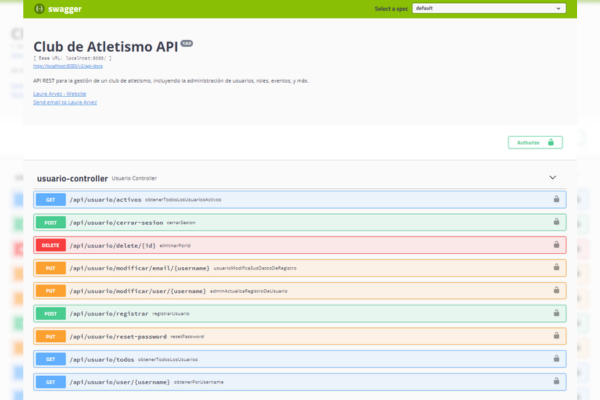

# Spring Boot & JWT Authentication - Backend API
 
## Descripción del Proyecto

Este proyecto es una **API RESTful** desarrollada con **Spring Boot** que implementa un sistema de gestión de usuarios y autenticación basada en **JWT (JSON Web Tokens)**. 
La aplicación permite gestionar usuarios, roles y contraseñas, así como realizar CRUD de usuarios con roles asignados. 
Está diseñada para ofrecer una arquitectura sólida, segura y extensible, y cuenta con seguridad de endpoints utilizando **Spring Security**.

La API también cuenta con **Swagger** para documentar las rutas y facilitar la interacción con la API a través de una interfaz gráfica.

## Características

- Autenticación y autorización basada en **JWT**.
- Gestión de usuarios con roles.
- Servicios de autenticación y autorización.
- Controladores para la creación, actualización y eliminación de usuarios.
- Seguridad de endpoints mediante **Spring Security**.
- Validaciones personalizadas para los atributos de los modelos.
- Manejo centralizado de excepciones.
- Documentación de API con **Swagger**.

## Tecnologías Utilizadas

- **Spring Boot** - Framework principal para la aplicación.
- **Spring Security** - Manejo de seguridad y autenticación con JWT.
- **JWT (JSON Web Tokens)** - Autenticación y autorización basada en tokens.
- **JPA (Java Persistence API)** - Persistencia de datos utilizando MySQL.
- **Swagger** - Documentación de API.
- **Lombok** - Generación automática de código (constructores, getters/setters).
- **MySQL** - Base de datos relacional.
- **Maven** - Herramienta de construcción y gestión de dependencias.
