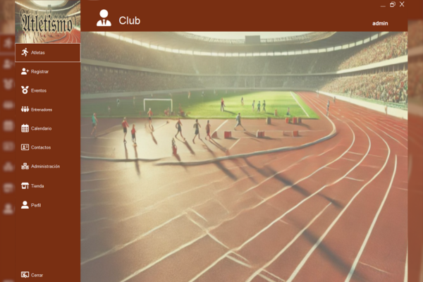
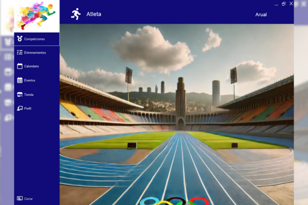

# Gestión de un Club de Atletismo
 

## Descripción
Esta aplicación de **Windows Forms** actúa como la interfaz de usuario de la aplicación **InterfazRest** para la gestión de un **club de atletismo**, 
conectada a una **API REST** desarrollada en **Spring Boot**. 
La interfaz permite a los administradores y atletas gestionar sus credenciales mediante autenticación, registro de usuarios, y modificación de contraseñas. 

Si bien algunas funcionalidades adicionales están en desarrollo, las principales características mencionadas están **completamente integradas con el servidor**.

**Nota:** Las imágenes utilizadas en la aplicación, como fondos, han sido **generadas por IA GPT**.

## Características

### Funcionalidades Conectadas al Servidor:
- **Login de Administrador**: Los administradores pueden iniciar sesión para gestionar la aplicación.
- **Login de Atleta**: Los usuarios atletas pueden iniciar sesión en la aplicación para acceder a sus funcionalidades.
- **Registro de Nuevos Usuarios**: Los administradores pueden registrar nuevos atletas y usuarios del club.
- **Modificación de Contraseñas**: Los administradores pueden restablecer o modificar las contraseñas de los usuarios.

### Funcionalidades en Desarrollo (Aún no conectadas al servidor):
- **Gestión de Atletas**: Administra y visualiza la lista de atletas registrados.
- **Visualización y Registro de Competencias**: Permite a los atletas inscribirse y visualizar competencias.
- **Gestión de Eventos y Calendarios**: Funcionalidad para gestionar eventos deportivos y ver calendarios de competencias.
- **Gestión del Perfil de Usuario y Tienda en Línea**: Perfil de usuario y compra de productos relacionados con el club.

## Tecnologías Utilizadas

- **C#** - Lenguaje de programación principal utilizado para desarrollar la aplicación.
- **Windows Forms** - Plataforma utilizada para crear la interfaz gráfica.
- **FontAwesome.Sharp** - Librería de iconos para enriquecer la experiencia visual de los botones y menús.
- **Spring Boot API** - API RESTful a la cual se conecta la aplicación para interactuar con la base de datos.
- **MySQL Workbench** - Plataforma utilizada para administrar la base de datos MySQL.
- **IA GPT** - Generación de imágenes para el fondo de los formularios.

 ## Instalación
 1. **Clona el repositorio**:  ```bash   git clone https://github.com/tu_usuario/WindowsFormsApp.git
 2. **Compila y ejecuta** el proyecto desde Visual Studio.
 3. **Configura la conexión al servidor** Spring Boot en los archivos de configuración.
 4. Asegúrate de que el **backend esté corriendo** y la **base de datos** esté correctamente configurada.
